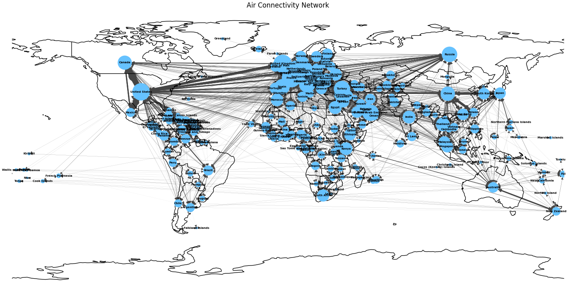
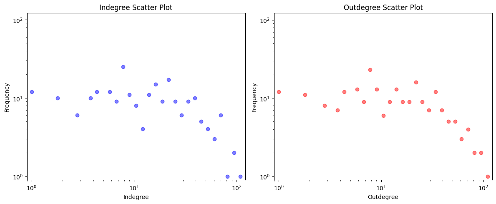
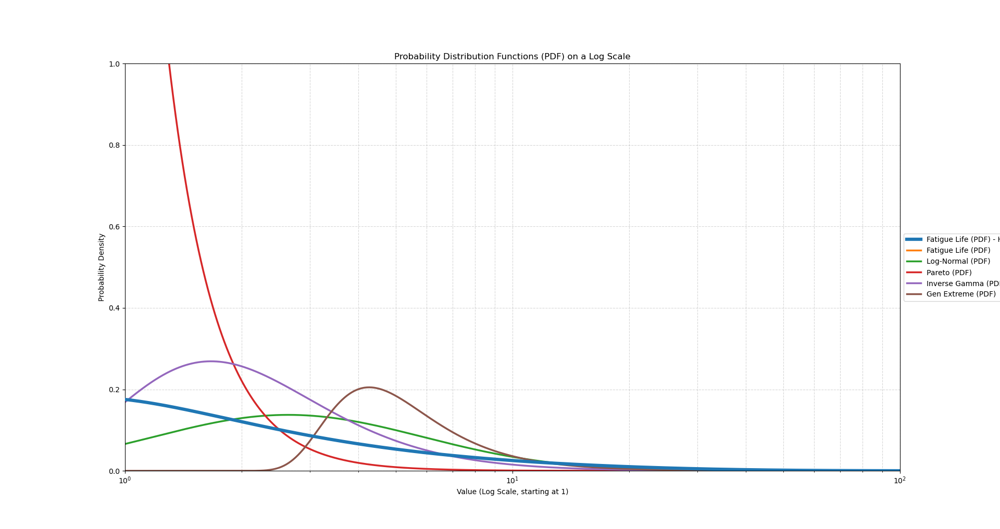
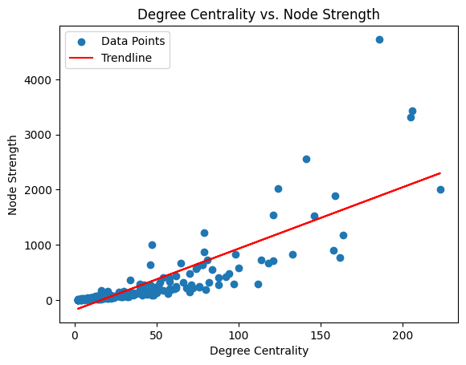
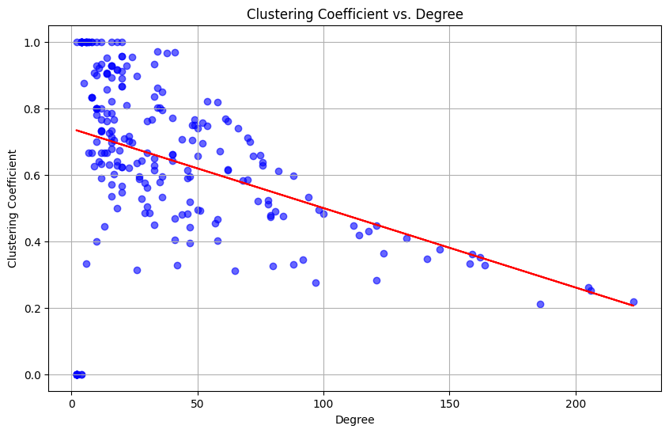

## Overview

The world today is extremely well connected, a network of transit hubs for a large number of people. One can be living in one part of the world and be able to reach another part. While this is a very powerful ability, the idea behind this analysis was to check just how powerful this network is, including major hubs, their connectivity and how they cluster with traffic.

This project was done under the superivison of Prof Udit Bhatia, as part of the Networks and Complex Systems course taken at IITGN, where we were taught about Networks Science. The network under analysis has 227 countries represented as nodes, and flight routes and the traffic volume representing the weighted edges. The full code of the analysis is hosted as a colab file [here](placeholder-for-link).

## 1. Network Visualisation

The first step to any network analysis is always visualisation, as it helps provide clarity as to what the next steps should be. 

Due to the fact that this is a network based on real world coordinates, the visualisation would be much better served if the backdrop for the same was the world map. This was achieved using the `cartopy` library for world projection. The country coordinates were loaded from Google's developer public data portal. The node sizes were constructed scaled with degree, providing a sense of scale for connectivity.

*Figure 1: Air Connectivity Network on the world map.*

A cursory visual inspection showcases that there exist hubs with high density, primarily in Europe, North America and East Asia. This kind of hub and spoke structure is a classic hallmark of a real world complex networks.

## 2. Degree Distribution and Characterisation

### 2.1 Logarithmic Binning

A proper visualisation of the degree distribution requires **logarithmic binning** for the plots. This is due to linear binning severly underrepresenting the tail of heavy-tailed distributions, making the tails look like noise. Logarithmic binning groups values into exponentially wider bins, to ensure the full range of the distribution is visible on a log-log plot. The idea of logarithmic binning is especially useful when it comes to dealing with data on a wide power distribution.

*Figure 2: Log-binned scatter plots for in-degree (left) and out-degree (right).*

Both Indegree and Outdegree disributions show a right skewed shape, comparatively larger number of nodes with few connections, while a few having a large number of connections.

### 2.2 Distribution Characterisation

Identifying which statistical distribution best desccribed the degree disributions, I used the Cramer-Von Mises test, a statistical goodness-of-fit test used to determine whether a set of observed data comes from a specific theoretical distribution. I also used the Kolmogorov-Smirnov test. I ran these two across all continous disributions in `scipy.stats`.

**Kolmogorov–Smirnov (KS) test:** The KS test measures the maximum absolute difference between the empirical CDF and the theoretical CDF of a candidate distribution:

$$D = \sup_x \left| F_n(x) - F(x) \right|$$

**Cramér–von Mises (CVM) test:** The CVM test meanwhile, measures the integrated squared difference between the two CDFs, making it more sensitive to deviations across the full range rather than just the maximum:

$$W^2 = \int_{-\infty}^{\infty} \left[ F_n(x) - F(x) \right]^2 dF(x)$$

Any distribution with a p-value below 0.05 on either test was discarded. Twenty-six distributions survived both tests, including `lognorm`, `pareto`, `invgamma`, and `genextreme`. Among these, the **Fatigue Life (Birnbaum–Saunders) distribution** returned the highest CVM p-value and was identified as the best fit.

*Figure 3: Comparative plotting of distributions*

> The degree distribution, while heavy-tailed, was not observed to be a clean powerlaw. The Fatigue Life distribution, right skewed and commonly used to model failure times in engineering was found the fit the distribution the best.

## 3. Pearson Correlation Between Centrality Measures

The **Pearson correlation coefficient** measures the strength of the linear relationship between two variables. For two distributions $x$ and $y$ with $n$ data points, $r$, the coefficient is calculated using the formula: 

$$r = \frac{\sum_{i=1}^{n}(x_i - \bar{x})(y_i - \bar{y})}{\sqrt{\sum_{i=1}^{n}(x_i - \bar{x})^2} \cdot \sqrt{\sum_{i=1}^{n}(y_i - \bar{y})^2}}$$

The coefficient is a measure of correlation, between two measures. The strength and direction of their relationship. It ranges from $-1$ (perfect negative) to $+1$ (perfect positive), with $r = 0$ indicating no linear relationship. 

Computing $r$ between degree centrality and three centrality measures provides the following:

| Centrality Pair | Pearson $r$ | Interpretation |
|---|---|---|
| Degree ↔ Betweenness | **0.7368** | High-degree nodes also lie on many shortest paths |
| Degree ↔ Closeness | **0.9006** | Well-connected countries are also geodesically close to all others |
| Eigenvector ↔ Degree | **0.9604** | The most "influential" nodes by eigenvector are almost always the highest-degree ones |

All three pairs show strong positive correlation. The near-perfect Eigenvector–Degree correlation (0.96) suggests that in this network, degree alone is a very good proxy for node influence, that is the neighbours of a high-degree node tend to also be high-degree, reinforcing its eigenvector score.

## 4. Degree Centrality vs. Node Strength

The **degree centrality** counts the number of connections at a node, and the **node strength** sums the weights of these connections. In this case, it is the total flight traffic volume.

*Figure 3: Degree Centrality vs. Node Strength (r = 0.822).*

A strong positive correlation shows countries with more flight connections handling more traffic. An intiuituve result, but not necessarily strict, a country could be a connecting node on a very high traffic route, without necessarily being a high degree node. This scatter shows a handful of such cases, but overall, holds the linear trend well.

## 5. Degree vs. Clustering Coefficient

The **local clustering coefficient** of a node $i$ measure just how close its neighbours are to forming a complete clique: the fraction of possible neighbour-neighbour connections that actually exist. 

One may think of it as a resiliency measure, of how well connected the network is when when a few major nodes go down.

The clustering coefficient is calculated as follows: 

$$C_i = \frac{2 \cdot T_i}{k_i (k_i - 1)}$$

where $T_i$ is the number of triangles passing through node $i$ and $k_i$ is its degree. A value of 1 means all neighbours are also connected to each other; a value of 0 means none are.

*Figure 4: Clustering Coefficient vs. Degree (r = −0.383).*

The negative correlation is a signature of a **hierarchical network structure**. High-degree hub nodes connect to many countries that are not directly connected to each other, they bridge otherwise disconnected parts of the world. Lower-degree nodes, on the other hand, tend to be part of tight regional clusters (e.g., island nations with strong intra-regional connectivity), yielding higher clustering coefficients.

This behaviour is also consistent with the theoretical prediction for Barabási–Albert networks, where:

$$C_l \approx \frac{m}{4} \cdot \frac{(\ln N)^2}{N}$$

which decreases with $N$, implying that as the network grows and high-degree hubs accumulate more edges, their clustering coefficients drop.

## 6. Small World vs. Ultra Small World

The **average shortest path length** $\langle \ell \rangle$ was computed over the full network ($N = 227$ nodes) using NetworkX.

There are two commonly used thresholds for classifying a network:

| Network Type | Condition |
|---|---|
| Small World | $\langle \ell \rangle \approx \log N$ |
| Ultra Small World | $\langle \ell \rangle \approx \log \log N$ |

For $N = 227$:

$$\log_{10}(227) \approx 2.36 \qquad \log_{10}(\log_{10}(227)) \approx 0.37$$

The computed average shortest path was close to $\log N$, firmly placing this in the **small world** category. This means any two countries in the network are reachable in roughly 2–3 hops on average. A result that would align well with real world intiution about the global aviation network.